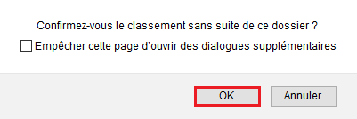
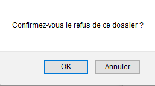

# Prendre une décision sur le dossier

Lors du traitement des dossiers, l'instructeur peut choisir d'instruire les dossiers un à un ou bien [**d'instruire les dossiers en masse.** ](https://doc.demarches-simplifiees.fr/tutoriels/tutoriel-instructeur#id-4.-instruction-en-masse-des-dossiers)

L’instruction du dossier peut aboutir à trois décisions :&#x20;

* Accepter
* Classer sans suite
* Refuser

Dans les trois cas, **la décision peut être motivée** par le biais d'un encart spécial : ce motif est optionnel en cas d'acceptation, **mais est obligatoire dans les deux autres cas.** Celui-ci peut par ailleurs apparaître ou non dans les e-mails reçus par l'usager ou sur l'attestation en fonction des paramètres retenus par l'administrateur de la procédure.&#x20;

Par ailleurs, il est **également possible de joindre un justificatif à la décision** lequel sera reçu par l'usager sur la boite e-mail associée à son compte.&#x20;

## Accepter le dossier

Cliquez sur le bouton « **instruire le dossier** » en haut à droite de l’écran puis cliquer sur le bouton « **Accepter** ». L’instructeur peut alors rédiger une motivation dans l'encart dédié qui sera consultable par l’usager dans son dossier après acceptation. Dans le cas d'une acceptation, cette motivation reste optionnelle.&#x20;

L'instructeur a également la **possibilité de transmettre une pièce jointe** au moment de l'acceptation du dossier et de **prévisualiser l'attestation automatique d'acceptation**, (**uniquement si celle-ci a été paramétrée par l'administrateur de la démarche).**&#x20;

<figure><figcaption></figcaption></figure>

Cliquez ensuite sur le bouton « **Valider la décision** ». Confirmez le choix de validation en cliquant sur le bouton « **OK** » comme suit :

<figure><figcaption></figcaption></figure>

**Un message automatique est envoyé à l’usager** afin de le notifier de l’acceptation de son dossier. La motivation est consultable par l'usager sur son dossier. Elle peut aussi être envoyée dans le corps du message automatique si le message a été paramétré ainsi par l'administrateur.

Le dossier passe automatiquement dans l’onglet des dossiers traités.

## Classer sans suite le dossier

Cliquez sur le bouton « **En instruction** » en haut à droite de l’écran puis cliquer sur le bouton « **Classer sans suite ». L’instructeur doit alors remplir une motivation** qui sera consultable par l’usager dans son dossier après classement sans suite. Cliquez sur le bouton « **Valider la décision** ». Confirmez le choix de validation en cliquant sur le bouton « **OK**» .

<figure><figcaption>
Classement sans suite d'un dossier
</figcaption></figure>

Un message de notification est envoyé à l’usager. Le dossier passe automatiquement dans l’onglet des dossiers traités.

## Refuser le dossier

Cliquez sur le bouton « **En instruction** » en haut à droite de l’écran puis cliquer sur le bouton « **Refuser** ». L’instructeur doit alors **rédiger une motivation** qui sera consultable par l’usager dans son dossier après acceptation. Cliquez sur le bouton « **Valider la décision** ». Confirmez le choix de validation en cliquant sur le bouton « **OK** ».

<figure><figcaption>
Refuser un dossier en tant qu'instructeur
</figcaption></figure>

Un message automatique est envoyé à l’usager afin de le notifier du refus de son dossier. La motivation est consultable par l'usager sur son dossier. Elle peut aussi être envoyée dans le corps du message automatique si le message a été paramétré ainsi par l'administrateur.

Le dossier passe automatiquement dans l’onglet des dossiers traités.

Quelle que soit la décision du dossier, l'instructeur a la possibilité de joindre une pièce jointe à la décision en cliquant sur "ajouter un justificatif".&#x20;

## Repasser un dossier en instruction

Une fois la décision prise, **si celle-ci a été prise par erreur ou si l'instructeur souhaite revenir sur sa décision, il est possible de repasser le dossier en instruction**.

Cliquez sur le bouton relatif au statut du dossier (Accepté, Classé sans suite ou Refusé) en haut à droite de l’écran puis cliquez sur le bouton « **Repasser en instruction**». &#x20;

Un **mail automatique** sera alors envoyé à l’usager afin de l’informer du **réexamen de son dossier**.\
Les **administrateurs de la démarche** ont la possibilité de **paramétrer le contenu de ce mail** selon leurs besoins.


**ATTENTION** : l'acceptation d'un dossier est une action créatrice de droits. Revenir sur cette décision dans un **délai supérieur à 4 mois** après l'avoir prise peut vous exposer à des risques de poursuites de la part de l'usager.&#x20;


## Prendre une decision en masse sur plusieurs dossiers

Quelle que soit la décision (acceptation, classement sans suite ou refus des dossiers), **le processus est le même.**&#x20;

Dans l'onglet des dossiers suivis, l'instructeur doit cocher la case tout en haut pour sélectionner tous les dossiers, ou bien les cases correspondants aux dossiers qu'il souhaite instruire. Puis, il doit cliquer sur le bouton bleu "instruire les dossiers" et sélectionner la décision souhaitée entre "Accepter les dossiers", "Refuser les dossiers" ou bien "Classer sans suite les dossiers".&#x20;

A savoir que le motif de la décision pour les dossiers acceptés est optionnel, il est en revanche **obligatoire** pour les dossiers refusés et classés sans suite.&#x20;

<figure><figcaption></figcaption></figure>

**Le motif renseigné sera le même pour tous les dossiers sélectionnés puisqu'il s'agit d'une action en masse**. L'usager sera notifié par email du motif de la décision.&#x20;

Un justification optionnel peut aussi être envoyé en masse à tous les dossiers sélectionnés.&#x20;

<figure><figcaption></figcaption></figure>

Une fois la décision "de masse", le bandeau suivant apparaîtra vous informant qu'une action de masse est en cours:&#x20;

<figure><figcaption></figcaption></figure>


A noter : Les actions de masse peuvent prendre un certain temps en fonction du nombre de dossiers sélectionnés. Il se peut que vous deviez recharger la page pour que l'action soit effectuée.&#x20;


Lorsque l'action de masse est effectuée, vous retrouverez les dossiers qui ont été instruits dans l'onglet des dossiers "traités": un bandeau vert vous informe que l'action de masse d'instruction des dossiers est terminée.&#x20;

<figure><figcaption></figcaption></figure>
