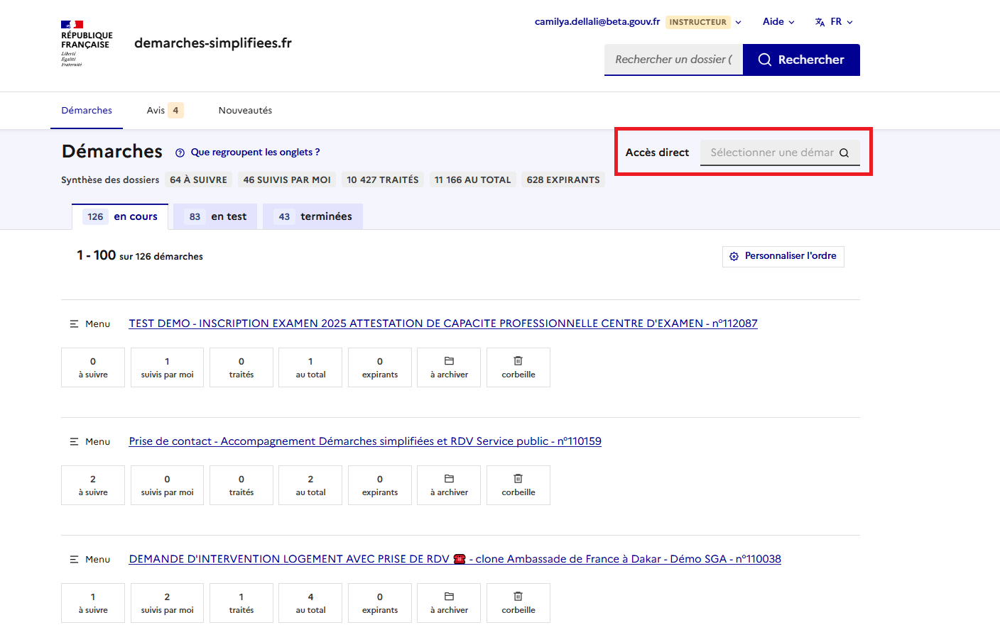

# Le tableau de suivi des procédures

Vous pouvez **accéder à la liste des démarches** en cliquant sur le bouton **« Démarches »**, situé en haut de votre interface.\
Cette interface vous permet d’avoir une **vue d’ensemble des procédures** pour lesquelles vous avez été **nommé.  Le nom de la démarche, son numéro, les compteurs de dossiers ainsi que le détail des notifications y figurent.** Cela vous permet de **prendre connaissance des dernières informations de suivi** avant d’accéder individuellement aux dossiers.\
Il s’agit des **mêmes badges de notifications** qui peuvent également être affichés dans le tableau de suivi des dossiers.

<figure><figcaption></figcaption></figure>

Les démarches sont classées dans plusieurs onglets :&#x20;

L’onglet **« en cours »** regroupe les démarches publiées ainsi que les démarches closes ayant encore des dossiers à traiter.

L’onglet **« en test »** regroupe les démarches qui ne sont pas encore publiées. Les dossiers déposés pendant la phase de test seront automatiquement supprimés lors de la modification ou de la publication de la démarche.

L’onglet **« terminée »** regroupe les démarches closes n'ayant plus de dossiers à traiter.

<figure><figcaption></figcaption></figure>

Vous avez la possibilité de personnaliser l'ordre d'affichage des démarches . Pour cela, il suffit de cliquer sur le bouton "**personnaliser l'ordre**" :&#x20;

<figure><figcaption>
La liste des démarches en tant qu'instructeur 
</figcaption></figure>

Vous pourrez alors déplacer les démarches dans la liste pour les classer en fonction de vos préférences comme ci-dessous :&#x20;

<figure><figcaption>
Personnalisation de l'ordre des démarches
</figcaption></figure>

Pour accéder directement, il est désormais possible de sélectionner la démarche concernée depuis la barre de recherche " **accès direct "** située à droite de votre interface instructeur :&#x20;

<figure><figcaption>
Accès direct à une démarche 
</figcaption></figure>

Vous avez également la possibilité de **rechercher directement un dossier** par son **numéro** ou un **mot-clé**, grâce à la **barre de recherche située en haut à droite** de votre interface.

<figure><figcaption></figcaption></figure>

Enfin, vous avez également la possibilité d’accéder directement aux différents onglets et fonctionnalités de la démarche, telles que **«Suivi des dossiers »**, **« Gestion de la démarche »**, **« Accompagnement des usagers »** et **« Téléchargements »**, grâce au **bouton « Menu »** situé à gauche de l’intitulé de la démarche, comme ci-dessous :

<figure><figcaption></figcaption></figure>

